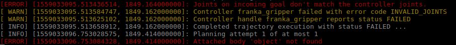
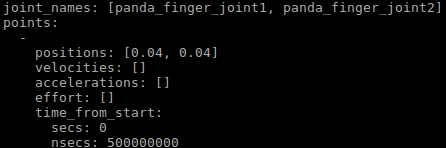
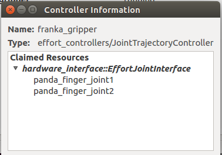

# ROS Framework Hardwares

## IIWA 7 Hardware Interface
1. Here we don't discuss the IIWA operation over the Java side of the robot.
2. Configure the robot and IIWA IP address and should be in the same network.
3. Also configure the `ROS_IP` and `ROS_MASTER_URI`
4. Before lauching the iiwa control run `roscore`to set `/iiwa/publishJointStates` is `true`in the parameter server. Or edit the launch file to do the same.
5. `roslaunch iiwa_moveit moveit_planning_execution.launch sim:=<true|false>` to run the ros iiwa controller and move_group. False if we need to run harware.
6. Created and tested new gripper package for WSG 50 Shunk gripper. Launch file is integrated with iiwa hardware launch

### Pilz industrial motion interface (PTP, LIN, CIRC) first success stages
1. Predifined robot pose from the "srdf" is working however the problem occurs during the cartesian pose.
2. @solution: Currently problem is narrow down to motion planning request detailed decoding the code :) found in ($PROJECT)/pilz_industrial_motion/pilz_robot_programming/src/commands.py (200)
3. @Failed: the planning interdace function "contructMotionPlanningRequest" is failed to generate the respective mmoveit_msgs
4. @Solution2: [Planning with path contrains](http://docs.ros.org/kinetic/api/moveit_tutorials/html/doc/move_group_interface/move_group_interface_tutorial.html#planning-with-path-constraints)
5. @Working: for some reason Pose is calculated from the "/iiwa_interface" as the reference frame than "iiwa_link_0" this not able to change to the requirement. position on Z axis is with respect to the "/iiwa_interface" Also goal_constraints is set using "setTrajectoryConstraints" accoring the pilz_industrial motion requiment. Also path constrains are not required. [pilz trajectory doc](https://github.com/PilzDE/pilz_industrial_motion/tree/6725b6611834b5f4f5124b2157f945f5e166ce7f/pilz_trajectory_generation#input-parameters-in-moveit_msgsmotionplanrequest)
     

## Panda Hardware interface
1. libfranka requires real-time [ubuntu kernel](https://frankaemika.github.io/docs/installation.html#setting-up-the-real-time-kernel)
2. All source code must be compiled with [`-DCMAKE_BUILD_TYPE=Release`](https://frankaemika.github.io/docs/troubleshooting.html#troubleshooting) for *libfranka* and *franka_ros*. For binary installation this is not required.
3. Test the libfranka and FCI is properly interfaced
    * `./echo_robot_state <fci_ip>` or `rosrun libfranka echo_robot_state <fci_ip>`
    * `rosrun libfranka communication_test <fci_ip>`
4. For ROS control first launch [franka control](https://frankaemika.github.io/docs/franka_ros.html#franka-control)
   * ```roslaunch franka_control franka_control robot_ip:=<fci_ip> load_gripper:=<true|false>```
5. Sate of the robot can be seen throught the topic
   * `rostopic echo /franka_state_controller/franka_state` 
   * Message is `uint8 robot_mode`
   * When `robot_mode = 2` then the robot is completly operational.
6. If the robot mode changes during the collision or user pressing the button, then franka controller will go into the error mode. This can be resolved by publishing the following topic.
   * `rostopic pub -1 /franka_control/error_recovery/goal franka_control/ErrorRecoveryActionGoal "{}"`

## Simualtion Test and Documentation
1. Panda pick and place error is solved:
    *  
    
   * TODO: Change the message from position control to effort control.
2. Sensor fusion
    * New Omron urdf is create and instead of writing the gazebo plugin for differential drive simulation I have written the differential drive controller using control manager
    * Howver the there exist the problem where AMCL is not broadcasting the map->odom 
    * The problem is narrow down to the scan topic published by the gazebo contains the namespace and in the tf tree there is no namespace
    * Hence this problem has to be solved before the implementation of move_base.

## TODO!
1. After the new intergration of updated wsg50 package, the simulation could not find hardware interface to respective finger joint.
2. Because in the new version finger joint name is changed
3. Check this again!